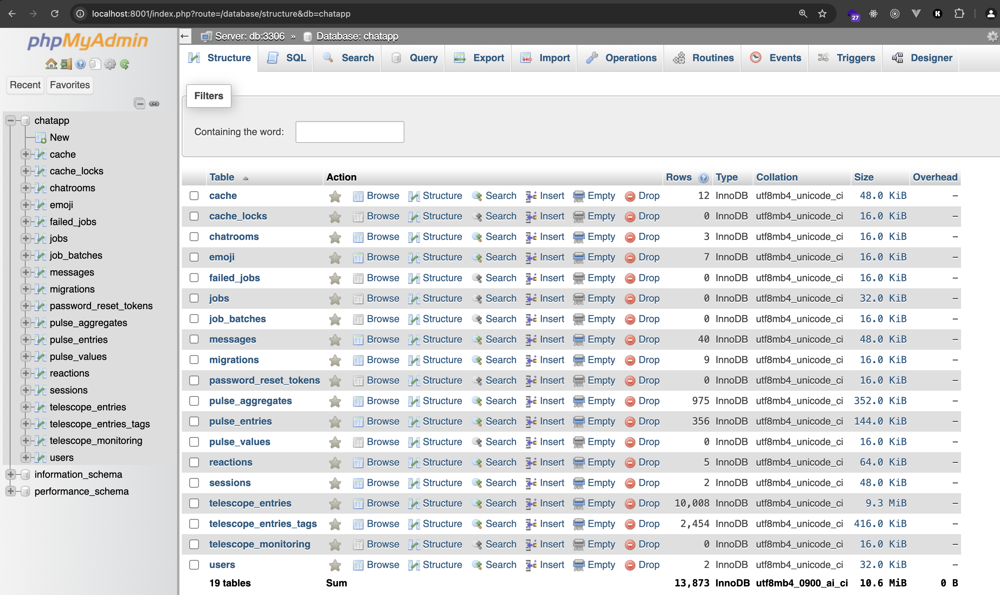

# Introduction
Realtime chat app with Laravel, VueJS, Laravel Echo, SocketIO, Redis including Queue, Schedule Task, Laravel Horizon, Laravel Telescope and Laravel Pulse

## Overview
This app contains following features:
- Multiple chat rooms
- Realtime chat with Private and Presence Channel
- Each room contains Share area (everyone can chat) or Private chat with a specific user in the room
- Bot scheduled message
- Message reaction like Facebook Messenger (Realtime notify others on reaction)
- Confetti Celebration animation
- Change message color (private chat)
- phpMyAdmin - database management
## Screenshots


<div class="tip" markdown="1">





</div>

# Run with Docker
## Default (as root)

First create `.env` from `.env.docker`

<details>
  <summary>Next we need to install dependencies for both Laravel and Frontend (VueJS):</summary>
  
  ```shell
  # MacOS + Linux
  docker run --rm -v $(pwd):/app -w /app composer:2.8.3 install

  docker run --rm -v $(pwd):/app -w /app node:22-alpine npm install

  docker run --rm -v $(pwd):/app -w /app node:22-alpine npm run build


  # If Windows see below:

  # Git bash
  docker run --rm -v "/$(pwd)":/app -w //app composer:2.8.3 install

  docker run --rm -v "/$(pwd)":/app -w //app node:22-alpine npm install

  docker run --rm -v "/$(pwd)":/app -w //app node:22-alpine npm run build

  # PowerShell
  docker run --rm -v "$(pwd):/app" -w /app composer:2.8.3 install

  docker run --rm -v "$(pwd):/app" -w /app node:22-alpine npm install

  docker run --rm -v "$(pwd):/app" -w /app node:22-alpine npm run build

  # Command Prompt
  docker run --rm -v "%cd%:/app" -w /app composer:2.8.3 install

  docker run --rm -v "%cd%:/app" -w /app node:22-alpine npm install

  docker run --rm -v "%cd%:/app" -w /app node:22-alpine npm run build

  ```
</details>

<br>


Then build + start all services:

```
docker compose up -d --build
```

Next, migrate+seed database:
```shell
docker compose exec app php artisan migrate --seed
```

Finally you can access the app at `http://localhost:8000`

phpMyAdmin (database management) can access the app at `http://localhost:8001`

Laravel Telescope can be accessed at `http://localhost:8000/telescope`

Laravel Pulse can be accessed at `http://localhost:8000/pulse`

## As non-root user (better, recommended for production)
First create folder `.docker` at root folder project, this is to store MySQL data (when running as non-root user we should not leave it for Docker to create automatically because it'll be owned by root)

Then create `.env` from `.env.docker`

Next, change ownership of all files in current directory to be under user `1000:1000`:

```
sudo chown -R 1000:1000 .
```
This is because later all containers will run with that user, and since we mount volume from host machine to container, and the permission of files from host container takes precedence therefore we need to sync permission between both environments

> [!TIP]
> You can choose any other user than `1000:1000`, but make sure to use 1 user across steps below

<details>
  <summary>Next we need to install dependencies for both Laravel and Frontend (VueJS):</summary>
  
  ```shell
  # MacOS + Linux
  docker run --rm -u 1000:1000 -v $(pwd):/app -w /app composer:2.8.3 install

  docker run --rm -u 1000:1000 -v $(pwd):/app -w /app node:22-alpine npm install

  docker run --rm -u 1000:1000 -v $(pwd):/app -w /app node:22-alpine npm run build


  # If Windows see below:

  # Git bash
  docker run --rm -u 1000:1000 -v "/$(pwd)":/app -w //app composer:2.8.3 install

  docker run --rm -u 1000:1000 -v "/$(pwd)":/app -w //app node:22-alpine npm install

  docker run --rm -u 1000:1000 -v "/$(pwd)":/app -w //app node:22-alpine npm run build

  # PowerShell
  docker run --rm -u 1000:1000 -v "$(pwd):/app" -w /app composer:2.8.3 install

  docker run --rm -u 1000:1000 -v "$(pwd):/app" -w /app node:22-alpine npm install

  docker run --rm -u 1000:1000 -v "$(pwd):/app" -w /app node:22-alpine npm run build

  # Command Prompt
  docker run --rm -u 1000:1000 -v "%cd%:/app" -w /app composer:2.8.3 install

  docker run --rm -u 1000:1000 -v "%cd%:/app" -w /app node:22-alpine npm install

  docker run --rm -u 1000:1000 -v "%cd%:/app" -w /app node:22-alpine npm run build

  ```
</details>

<br>

Then build + start all services:

```
docker compose -f docker-compose.non-root.yml up -d --build
```

Next, migrate+seed database:
```shell
docker compose -f docker-compose.non-root.yml exec app php artisan migrate --seed
```

Finally you can access the app at `http://localhost:8000`

phpMyAdmin (database management) can access the app at `http://localhost:8001`

Laravel Telescope can be accessed at `http://localhost:8000/telescope`

Laravel Pulse can be accessed at `http://localhost:8000/pulse`

Finally you can access the app at `http://localhost:8000`

Note that if you need to `exec` in your container you need to use:

```
docker compose -f docker-compose.non-root.yml exec app sh
```

# Deployment

When deploy your app to production remember to change this:
```
VITE_REVERB_HOST="your-domain.com"
VITE_REVERB_PORT="80"
VITE_REVERB_SCHEME="http"

# or with HTTPS

VITE_REVERB_PORT="443"
VITE_REVERB_SCHEME="https"
```

You **only** need to do this for Frontend (VITE_* variables), from server side, communication is still internally within Docker, hence `REVERB_PORT=8080` or `REVERB_SCHEME=http` remain unchanged