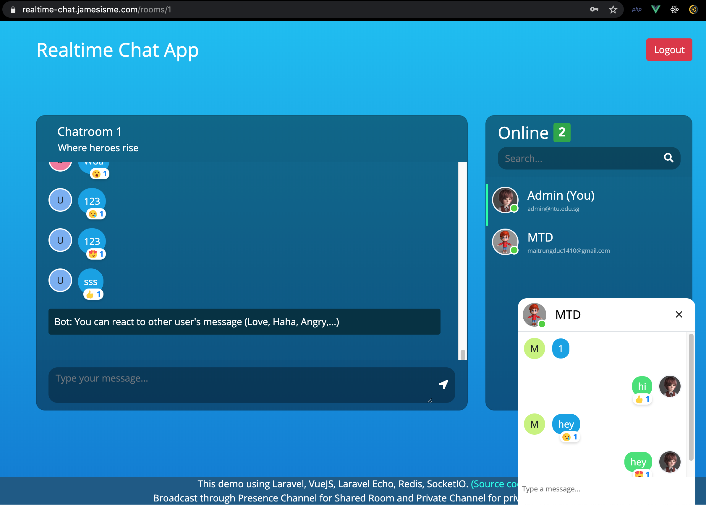
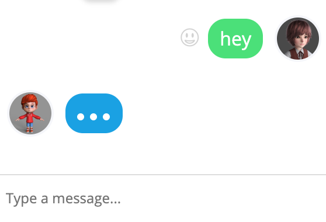
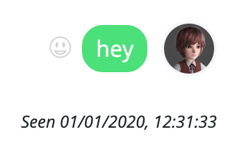
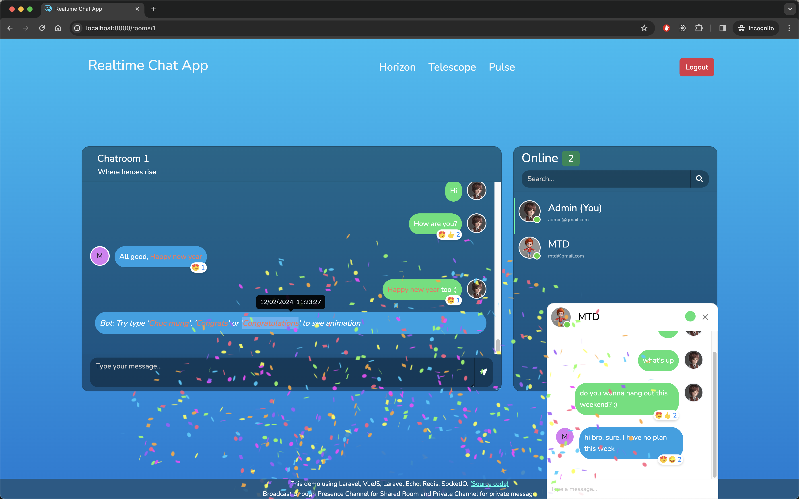
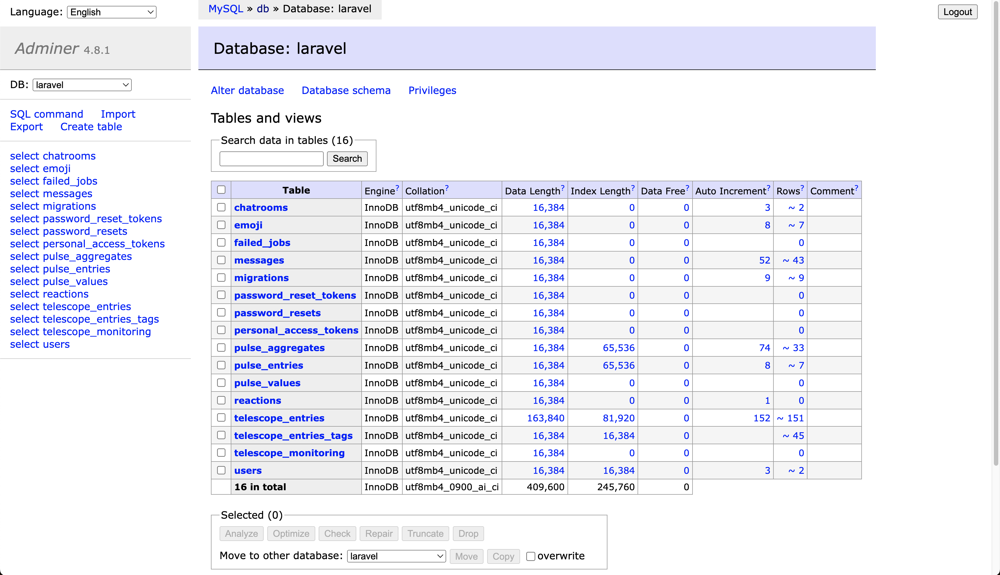
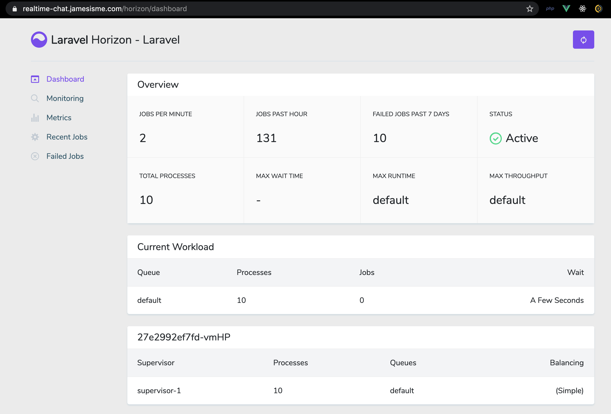
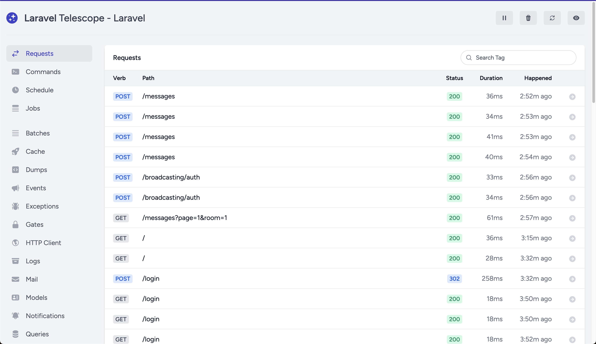
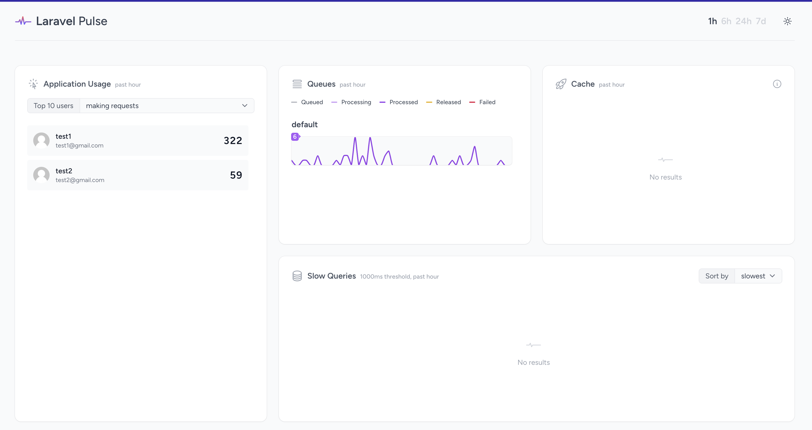

# Introduction
Realtime chat app with Laravel, VueJS, Laravel Echo, SocketIO, Redis including Queue, Schedule Task, Laravel Horizon, Laravel Telescope and Laravel Pulse

## Overview
This app contains following features:
- Multiple chat rooms
- Realtime chat with Private and Presence Channel
- Each room contains Share area (everyone can chat) or Private chat with a specific user in the room
- Notification to user on receiving message (both on side bar and on Topbar of browser)
- Bot scheduled message
- Message reaction like Facebook Messenger (Realtime notify others on reaction)
- Confetti Celebration animation
- Change message color (private chat)
- Adminer - database management
## Screenshots



<div class="tip" markdown="1">









</div>

# Run with Docker
## As root user (simpler)
First create `.env` by copying content from `.env.docker.example`:
```
cp .env.docker.example .env
```
If your app uses HTTPS then update `APP_FORCE_HTTPS=true` in `.env`

Next build and spin up the project:
```
docker compose up -d --build
```

<details>
  <summary>Next we need to install dependencies for both Laravel and Frontend (VueJS):</summary>
  
  ```shell
  # MacOS + Linux
  docker run --rm -v $(pwd):/app -w /app prooph/composer:8.2 install

  docker run --rm -v $(pwd):/app -w /app prooph/composer:8.2 dump-autoload

  docker run --rm -v $(pwd):/app -w /app node:20-alpine npm install

  docker run --rm -v $(pwd):/app -w /app node:20-alpine npm run build


  # If Windows see below:

  # Git bash
  docker run --rm -v "/$(pwd)":/app -w //app prooph/composer:8.2 install

  docker run --rm -v "/$(pwd)":/app -w //app prooph/composer:8.2 dump-autoload

  docker run --rm -v "/$(pwd)":/app -w //app node:20-alpine npm install

  docker run --rm -v "/$(pwd)":/app -w //app node:20-alpine npm run build

  # PowerShell
  docker run --rm -v "$(pwd):/app" -w /app prooph/composer:8.2 install

  docker run --rm -v "$(pwd):/app" -w /app prooph/composer:8.2 dump-autoload

  docker run --rm -v "$(pwd):/app" -w /app node:20-alpine npm install

  docker run --rm -v "$(pwd):/app" -w /app node:20-alpine npm run build

  # Command Prompt
  docker run --rm -v "%cd%:/app" -w /app prooph/composer:8.2 install

  docker run --rm -v "%cd%:/app" -w /app prooph/composer:8.2 dump-autoload

  docker run --rm -v "%cd%:/app" -w /app node:20-alpine npm install

  docker run --rm -v "%cd%:/app" -w /app node:20-alpine npm run build

  ```
</details>

<br>

Next, generate app key + migrate/seed database:
```shell
docker compose exec app php artisan key:generate

docker compose exec app php artisan migrate --seed
```

Finally you can access the app at `http://localhost:8000`

Adminer (database management) can access the app at `http://localhost:8001`

Laravel Horizon can be accessed at `http://localhost:8000/hoziron`

Laravel Telescope can be accessed at `http://localhost:8000/telescope`

Laravel Pulse can be accessed at `http://localhost:8000/pulse`

## As non-root user (better, recommended for production)
First create `.env` by copying content from `.env.docker.example`:
```
cp .env.docker.example .env
```
In `.env` change `LARAVEL_ECHO_SERVER_AUTH_HOST` to `http://webserver:8080`. If your app uses HTTPS then update `APP_FORCE_HTTPS=true`

Next, change ownership of all files in current directory to be under user `1000:1000`:

```
sudo chown -R 1000:1000 .
```
This is because later all containers will run with that user, and since we mount volume from host machine to container, and the permission of files from host container takes precedence therefore we need to sync permission between both environments

> [!TIP]
> You can choose any other user than `1000:1000`, but make sure to use 1 user across steps below

Next build and spin up the project:
```
docker compose -f docker-compose.non-root.yml up -d --build
```

<details>
  <summary>Next we need to install dependencies for both Laravel and Frontend (VueJS):</summary>
  
  ```shell
  # MacOS + Linux
  docker run --rm -u 1000:1000 -v $(pwd):/app -w /app prooph/composer:8.2 install

  docker run --rm -u 1000:1000 -v $(pwd):/app -w /app prooph/composer:8.2 dump-autoload

  docker run --rm -u 1000:1000 -v $(pwd):/app -w /app node:20-alpine npm install

  docker run --rm -u 1000:1000 -v $(pwd):/app -w /app node:20-alpine npm run build


  # If Windows see below:

  # Git bash
  docker run --rm -u 1000:1000 -v "/$(pwd)":/app -w //app prooph/composer:8.2 install

  docker run --rm -u 1000:1000 -v "/$(pwd)":/app -w //app prooph/composer:8.2 dump-autoload

  docker run --rm -u 1000:1000 -v "/$(pwd)":/app -w //app node:20-alpine npm install

  docker run --rm -u 1000:1000 -v "/$(pwd)":/app -w //app node:20-alpine npm run build

  # PowerShell
  docker run --rm -u 1000:1000 -v "$(pwd):/app" -w /app prooph/composer:8.2 install

  docker run --rm -u 1000:1000 -v "$(pwd):/app" -w /app prooph/composer:8.2 dump-autoload

  docker run --rm -u 1000:1000 -v "$(pwd):/app" -w /app node:20-alpine npm install

  docker run --rm -u 1000:1000 -v "$(pwd):/app" -w /app node:20-alpine npm run build

  # Command Prompt
  docker run --rm -u 1000:1000 -v "%cd%:/app" -w /app prooph/composer:8.2 install

  docker run --rm -u 1000:1000 -v "%cd%:/app" -w /app prooph/composer:8.2 dump-autoload

  docker run --rm -u 1000:1000 -v "%cd%:/app" -w /app node:20-alpine npm install

  docker run --rm -u 1000:1000 -v "%cd%:/app" -w /app node:20-alpine npm run build

  ```
</details>

<br>

Next, generate app key + migrate/seed database:
```shell
docker compose -f docker-compose.non-root.yml exec app php artisan key:generate

docker compose -f docker-compose.non-root.yml exec app php artisan migrate --seed
```

Finally you can access the app at `http://localhost:8000`

Adminer (database management) can access the app at `http://localhost:8001`

Laravel Horizon can be accessed at `http://localhost:8000/hoziron`

Laravel Telescope can be accessed at `http://localhost:8000/telescope`

Laravel Pulse can be accessed at `http://localhost:8000/pulse`

And you need 1 extra step to start cronjob:
```
docker compose -f docker-compose.non-root.yml exec -u root app crond -b
```
> [!NOTE]
> Because crontab needs to start with root in order to work, but our actually will still be guaranteed to run as non-root, check Dockerfile.non-root for more details

Finally you can access the app at `http://localhost:8000`

Note that if you need to `exec` in your container you need to use:

```
docker compose -f docker-compose.non-root.yml exec app sh
```